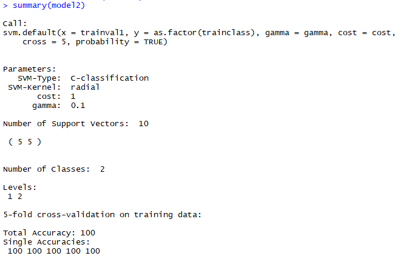

## Coupling UAV and Sentinel-2 data to map a class of interest ##

### Overview ###

In this Tutorial we will jointly use UAV data and Sentinel-2 data to estimate the fraction of bare soil in each Sentinel-2 pixel. The idea is similar to the study presented in the last part of last week's theoretical lecture where we learned how a combination of UAV and Sentinel-2 data can be used to map the fractional cover of invasive species. We will follow the approximately same work-flow here but with a simpler target variable.

### Learning objectives ###

The learning objectives of this Tutorial is:

- understanding how UAV data can be used to train satellite image-based regression models to map the fractional cover of a class of interest
- understand the effects of unbalanced training data on regression models

### Datasets used in this Tutorial ###

In this tutorial we will make use of several datasets, including 

- a Sentinel-2 image,
- a UAV scene,
- a Shapefile containing training data for classifying the UAV scene into two land-cover classes and
- a Shapefile containing a Polygon-grid that exactly overlaps with the location of the S2-pixels

The datasets can be downloaded here:

[https://drive.google.com/file/d/1td-MPxvdUannzqotska3dJThFqCQy1TA/view?usp=sharing](https://drive.google.com/file/d/1td-MPxvdUannzqotska3dJThFqCQy1TA/view?usp=sharing)

Please be aware that you might require Winrar or 7zip to unzip the data which are stored in the **.rar** format. In case you have neither of these programs installed on your computer, you can get them here:

[https://www.win-rar.com/start.html?&L=1](https://www.win-rar.com/start.html?&L=1)

[https://www.7-zip.org/](https://www.7-zip.org/)

### Step 1 - Exploring the data

To have a look at the data in this tutorial we open the provided QGIS-project file entitled **"qgis_overview.qgs"**. Once QGIS has opened and loaded the data, you should see the following screen:

We can see all of the datasets described above. The point-shapefile contains the training points for the supervised classification of the UAV image and contain ssamples covered with bare soil (1) and with other classes (2). The latter mostly consist of vegetation areas. Furthermore, we have a polygon-grid Shapefile which exactly follows the S2-pixel location and orientation. To see this, we can activate the **S2\_pre\_clipped_s19** layer and zoom in a bit which will show us the following situation:

Such a grid can be created either directly in QGIS or in R. We will not focus on this in this tutorial, but you can try creating your own grid using the tool available in QGIS at "Vector -> Research Tools -> Create Grid" (the exact names of the menu points may slightly differ depending on the QGIS version).

### Step 2 - Supervised Classification of the UAV data

As first processing step of the tutorial, we will now classify the UAV data into bare soil and other classes. In this case we could either use a one-class-classifier or a supervised classification with two classes. As in this example, we only have two dominant land-cover classes which should be well separable, it is ok to use a supervised classification.

By now, you should already be quite familiar with this process and the code provided below should be more or less familiar to you. As first step, we load the packages required to run the classification:

	
	### load packages
	
	pkgs<-c("rgdal","caret","raster","foreign", "kernlab", "e1071", "Hmisc", "GISTools", "randomForest")
	lapply(pkgs,require, character.only=T)
	
Then, we load all the datasets required for the classification, namely the UAV image:

	##########
	########## load datasets
	########## 
	
	## load UAV image
	
	# jump into folder that contains the image
	setwd("D:/Multiskalige_FE/Tag7_UAVs/1_Rasters")
	# display all files in the folder
	list.files()
	# load the UAV image
	uav_img <-stack("uav_pre_clipped_red.tif")

and the Shapefile containing the training data:
	
	# jump in directory where shapefile with training data is stored
	setwd("D:/1_multi_skalige_FE/Tag7_UAVs/2_Shapes")
	
	# load shapefile with training data 
	tr_data <- readOGR(".", "training")
	
Then we define an output directory and some output-filenames that we will use below to store the results:
	
	##########
	########## run SVM classification (parameter tuning and classification map)
	########## 
	
	
	# set output directory
	setwd("D:/Multiskalige_FE/Tag7_UAVs/3_outputs")
	
	# define output filenames
	## !! these have to be changed for each input image - otherwise results will be overwritten!!
	
	## filename for a table that will contain the accuracies for 100 iterative classification runs (last part of the script) 
	out2 <- "boxplots_table_uav.txt"
	## filename for a pdf file that will contain boxplots of the values described for the first output file
	out3 <- "boxplots_uav.pdf"
	## filename for a textfile that will allow to create a summarized confusion matrix for the 100 iterative classification runs (last part of the script) 
	out4 <- "summed_conf_uav.txt"
	## filename for a geotiff file that will contain the classification map when applying the SVM classifier 
	outImage1 <-'SVM_classification_uav.tif'
	## filename for a textfile that will give a first rough idea of the accuracies by conducting a 5-fold cross-validation
	res_cv <- "results_cross_validation_basic_uav.txt"

Next, we start preparing the data for the classification. First, we access the atttribute table of the training data and extract the class information (class 1 or 2) and store it to a variable in factor format.

	trainclass <-as.factor(tr_data@data$id)
	
Then, we extract the spectral values of each UAV pixel that contains one of the training dataspoints using the extract function:

	## assign input data loaded above to new variables 
	satImage <- uav_img
	vec <- tr_data
	
	# Extract pixel raster values from the satellite image for each sample/reference point of the vector/shapefile dataset
	trainval1 <- extract(satImage, vec, fun=mean)
	# we take a subset of the extracted values as the 4th channel of the UAV image is the brightness channel and does not contain real information
	trainval1 <- trainval1[,1:3]
	
Now, we are ready to run the classifiation. We will use a support vector machines classifier which requires to define some tuning parameters for an optimal classification success. We will obtain these parameters using an automated grid search procedure available in the caret package. This approach will systematically examine several combinations of settings of the two parameters and identify the combination with the best results:

	#############################################
	# Apply SVM with kernel radial basis function 
	
	# set.seed to allow for reproducible results
	set.seed(1173)
	
	# define tuning range of grid search for the support vector machines classification (see additional material on ILIAS)
	
	gammat = seq(.1, .9, by = .1)
	costt=seq(1,128, by = 12)
	
	# run parameter tuning
	# this part searches for sound settings of the SVM algorithm to maximize accuracy but avoid overfitting
	# the value ranges defined above are run iteratively and optimal values for
	# cost and gamma are determined
	tune1 <- tune.svm(trainval1, as.factor(trainclass), gamma = gammat, cost=costt)
	plot(tune1)

After running this code, we should see the following plot, which visualizes the results of the tuning process:

In the given case, the plot is not very informative as the classification process is so easy to solve, that all parameter combinations lead to a perfect, 100% accurracy with a 0% error.

The best parameters will hence be the ones from the simplest model (lowest values for both parameters). These values will be extracted using:

	
	# extract best parameters from parameter tuning
	gamma <- tune1$best.parameters$gamma
	cost <- tune1$best.parameters$cost
	

Now, we use these parameters to train two svm models. The first one uses all training samples to use the maximum amount of information. This model will be applied to the UAV image to obtain the classification map. In the second model a 5-fold cross-validation is applied to obtain some classification accuracies:

	
	# train model with all data (to use maximum information for the classification of the full image)
	# the identified best settings for gamma and cost are applied
	model <- svm(trainval1, as.factor(trainclass), gamma = gamma, cost = cost, probability = TRUE)
	# train model with 5-fold cross-validation to get first impression on accuracies
	model2 <- svm(trainval1, as.factor(trainclass), gamma = gamma, cost = cost, probability = TRUE, cross=5)

We have a look at the classification accuracies and see that the model is able to separate the training data perfectly

	summary(model2)

As demonstrated by the following output:

Next, we save these results to a textfile:
	
	# display and store results of 5-fold cross-validation
	# to have a first quick impression of the classification results
	sink(res_cv)
	summary(model2)
	sink()

And finally we apply the trained classifier to the full UAV image to obtain a classification map showing bare soil areas and another class summarizing all other land-cover classes:
	
	#apply model to the complete image - this will create a new raster dataset with a classification map
	svmPred <- predict(satImage[[1:3]], model, filename=outImage1, na.rm=TRUE, progress='text', format='GTiff', datatype='INT1U',overwrite=TRUE)
	plot(svmPred)

The corresponding plot looks like this:

This UAV-based classification map will now be our base data to obtain training datasets for mapping the %cover of bare soil for each Sentinel-2 pixel. However, first we have to extract this reference data.

### Step 3 - Estimating %cover soil for the S2-image using the UAV-based reference data

To derive our reference data from the UAV-based classification map, and then build a regression model between the reference data and the Sentinel-2 image, we will first have to load the Sentinel-2 data by running:

	setwd("D:/Multiskalige_FE/Tag7_UAVs/1_Rasters")
	s2_pre <- stack("S2_pre_clipped_s19.tif")

And then the regular grid which is spatially co-located with the S2-pixels:
	
	setwd("D:/Multiskalige_FE/Tag7_UAVs/2_Shapes")
	grid <- readOGR(".", "grid")

Be aware that we will only use a small subset of the full Sentinel-2 scene here, to save processing time. And we only use a subset of the subset for preparing the reference data using the grid-shapefile. The grid could be increased in size to cover larger areas of the UAV image. This would allow for collecting more reference samples, but would also require more time to extract the reference values.

We can have a look at the just loaded data by running:

	plotRGB(s2_pre, r=4, g=3, b=2, hist="stretch")
	par(new=T)
	plot(grid)

This will result in:

Next, we will load the classification map created in the first step of the tutorial by running:

	# load rasterfile with classification map
	setwd("D:/Multiskalige_FE/Tag7_UAVs/3_outputs")
	classmap <- stack("SVM_classification_uav.tif")

Alternatively, we could simply assign the already loaded classification map to the variable **"classmap"**.
Then, we will calculate the %cover of soil for each polygon-grid cell representing a Sentinel-2 pixel. To do this, we first extract all values of the UAV classification map pixels that fall within the individual grid cells (represensing a Sentinel-2 pixel). Each of these values is either 1 = soil or 2 = other class. We then save the extracted values to the disc, because this process takes quite a lot of time. Particularly, when applying the standard "extract" command of the raster package. There are alternative commands available that perform this task a lot faster, but this would require additional packages. Be aware that this step may run for several minutes!!

	
	# extract raster values of all pixels in the cluster polygons
	classes <- extract(classmap, grid)
	save(classes, file = "extracted_values.RData")

The resulting variable "classes" is a list-file that contains all the extracted values per grid cell. Each entry of the list corresponds to one grid cell. In the next step, we will now derive the %cover soil for each of these grid cells. To do this, we first create an empty matrix with as many rows as grid cells in the polygon-shapefile to save the results:
	

	# create empty matrix to store results
	results <- matrix(NA, nrow=length(grid), ncol=2)
	# rename column names
	colnames(results) <- c("soil", "vegetation") 
	head(results)

Then we run a for-loop in which we first take the i-th entry in the list, and  then count the number of UAV-pixels indicating a soil pixel and indicating another land-cover and divide them by the corresponding total number of pixels in the grid cell. With this process, we obtain the %cover fraction of both classes:
	
	# count pixels of all considered classes (soil, shadow, coniferous, broadleaved) in each cluster-polygon
	# calculate percentages of each class
	
	for(i in 1:length(grid)) {
	  
	  # get first polygon
	  data <- classes[[i]]
	  
	  # calculate percentages of each class
	  # 1 = soil; 2 = other classes (mostly vegetation)
	  results[i,1] <- length(data[data==1])/length(data)
	  results[i,2] <- length(data[data==2])/length(data)
	}

Next, we attach the obtained cover fractions to the grid-Shapefile and store the grid-shapefile containing the UAV-based reference information as a new Shapefile:

	# attach results to shapefile
	grid$percsoil <- results[,1]
	grid$percveg <- results[,2]
	
	#setwd("E:/Tag7_UAVs/out")
	
	# write out a new shapefile with attached results
	writeOGR(grid, ".", "grid_incl_fractions", driver="ESRI Shapefile")
	save(results, file="soil_veg_fr_new.RData")
	
Let's check the attribute table of Shapefile that we just stored by running:

	head(grid@data)

This will result in the following output:

We can see that the attribute table of the Shapefile (accessed by grid@data) now contains two columns that indicate the %cover of soil and the other classes (mostly vegetation). This is the information that will now be used as reference in the next step.

Before we can build a regression model between these reference data values and the Sentinel-2 spectral information, we first have to extract the spectral values of the Sentinel-2 pixels at the locations of the grid cells. To do this, we run:

	# calculate centroids of grid cells for which reference data is available
	centr <- getSpPPolygonsLabptSlots(grid)
	
	# extract sentinel 2 pixel values at centroid location
	preds <- extract(s2_pre, centr)

The additional step to convert the grid-shapefile to a centroid shapefile is conducted to speed up the extraction process, which works notable faster with point shapefiles than with polygon shapefiles. Calculating the centroid simply means that we create a new point-Shapefile by putting a point in the exact middle of each grid cell polygon.

After this, we have everything we need to create a regression model. In the given case, we will use a random forest model. To build the random forest model we run:

	# build random forest model between UAV reference (%vegetation) and Sentinel-2 reflectance values
	rfm1 <- randomForest(preds, results[,1], mtry=3)
	rfm1

This will result in a moderate accuracy of approximately 50% explained variance:

	
To better understand the model, we can have a look at the scatterplot between predicted and observed %cover soil values:

	# plot predicted vs. observed values
	plot(results[,2], rfm1$predicted, ylim=c(0,1), xlim=c(0,1), ylab="predicted", xlab="observed")
	abline(0,1, col="red")

This will result in the following plot:

We can see that the model may not be optimal as many points are clustered at very low %cov fraction of soil while only few samples are available for high fraction of bare soil. This is also visible in the histogram of the reference data values:
	
	# problem: uneven distribution of samples => model does not work well for samples with low soil percentage
	
	hist(results[,1])

Regression models built on such unbalanced training datasets, may perform quite poorly when applied to a larger dataset. Hence, we will try to modify the way we train our model a bit, by using only a subset of the available training samples but ensuring that the applied subset will be more balanced.

As a first step, we merge the response and the predictor variables into a single data frame by running:
	
	# attach uav-estimated %vegetation cover to s2-reflectance values
	
	preds_f <- as.data.frame(preds)
	preds_f$resp <- results[,1]

This data frame is then divided into three parts/strata according to the %cover soil fraction. We build one class with all samples between 0 and 33% cov soil, one with 33-66% and one 66-100% soil. Be aware that these classes will not contain an equal amount of samples.
	
	# build three sample-groups according to %vegetation cover classes
	cl1 <- preds_f[preds_f$resp < 0.33,]
	cl2 <- preds_f[preds_f$resp > 0.33 & preds_f$resp < 0.66,]
	cl3 <- preds_f[preds_f$resp > 0.66,]
	nrow(cl1)
	nrow(cl2)
	nrow(cl3)

As we can see, the cl1-dataframe contains most samples, the cl2 the second most, while fewest samples are observed for cl3.

	
In the next step, we will now randomly sample 20 samples from each of the strata. We will use sampling with replacement, which means that samples can be drawn several times. In the case of cl3 this is quite extreme in this example as we only have two original samples. That means, we will use a quite large number of duplicates which of course is not optimal for training a regression model. Anyway, for the moment we will stay with this approach and see to what this will lead. To accomplish the sampling with replacement, we run: 

	# sample 20 samples from each of the group - replace = T is necessary as for the s1 class only
	# three samples are available
	s1 <- cl1[sample(1:length(cl1[,1]), 20, replace=T),]
	s2 <- cl2[sample(1:length(cl2[,1]), 20, replace=T),]
	s3 <- cl3[sample(1:length(cl3[,1]), 20, replace=T),]

Then, we merge the resulting selected samples again to derive our input datasets for the regression model. We directly merge the predictor and response variables separately:
	
	# combine the reflectance and response values of the samples
	preds_fin <- rbind(s1[,1:10],s2[,1:10],s3[,1:10])
	resp_fin <- c(s1[,11], s2[,11], s3[,11])
	
Then we build a new random forest model and check the results:

	# build random forest model between UAV reference (%vegetation) and Sentinel-2 reflectance values
	rfm2 <- randomForest(preds_fin, resp_fin, mtry=3)
	rfm2
	

As we can see, this model performs a lot better. However, this is only partly a realistic result. As we use many samples double, there will be many trees in which random forest "knows" the solution for a validation sample, based on another identical sample being in the training dataset. However, if we compare the two scatterplots of the first model and our new model, we can see that the scatter of the points is closer to the 1:1 line than it was before. Particularly for values with higher bare soil cover, the new model seems to perform slightly better.

	# plot predicted vs. observed values
	plot(resp_fin, rfm2$predicted, ylim=c(0,1), xlim=c(0,1), ylab="predicted", xlab="observed")
	abline(0,1, col="red")
	

This also still holds true, if we predict the new model to all available samples and check the corresponding scatter plot:
	
	# predict model to all pixels
	estimates <- predict(rfm2, preds_f)
	plot(results[,1], estimates, ylim=c(0,1), xlim=c(0,1), ylab="predicted", xlab="observed")
	abline(0,1, col="red")

When checking the correlation for the second model using all predictors, the correlation is similar to the first model:

	cor(results[,1], estimates)^2

	
As final step, we will attach the predictions for %cover soil to the grid-shapefile and save it as a new Shapefile.

	# write out a new shapefile with attached results
	grid$veg_est <- estimates
	writeOGR(grid, ".", "veg_estimates", driver="ESRI Shapefile")

If we load this shapefile to QGIS and use the just attached estimates for the visualization of the polygon shapefile, we can see that the model results depict the areas with higher fractions of bare soil comparably well (In the depicted graph, areas with higher bare soil fraction are brighter/yellower).

With this we are already at the end of this Tutorial in which we learned how to combine reference data extracted from UAV data to train a model based on Sentinel-2 satellite data. As mentioned above, the targeted class could of course be easily varied in this work-flow. The only requirement is that the class of interest can be reliably detected in the UAV image. If this is not the case, the workflow cannot be applied.

In case you are still motivated to spend some more time with the data, you might want to try to further improve the random forest model by changing the extent or the location of the applied grid to extract reference values. In the western part of the uav image are some more areas with comparably high fractions of bare soil that might help to further balance the training dataset. Furthermore, you can try to also export the predictions for the first random forest model and compare it to the final model of this tutorial to examine whether the modification of the training dataset indeed brought an advantage or not.
